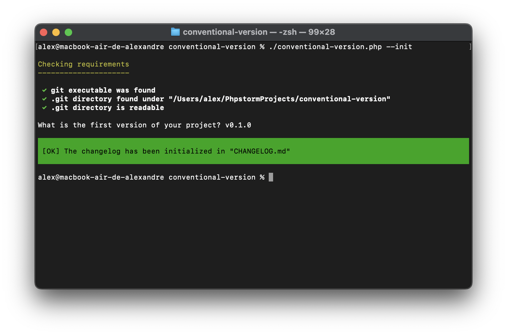

Conventional Version
====================

[](https://github.com/alexandre-daubois/conventional-version/actions/workflows/php.yaml)



## Requirements

- PHP 8.2 or higher
- Composer
- Git

That's it!

## Why this package?

This package is a simple tool to help you manage your changelog and versioning.
It uses the [Conventional Commits](https://www.conventionalcommits.org/) standard
to generate the changelog. This standard is widely used in the open-source
community and is a great way to ensure that your commit messages are
understandable and easy to parse.

Unlike [this package](https://github.com/marcocesarato/php-conventional-changelog), this one is under **the MIT license**. This licence is more permissive than the GPL-3.0 licence. This can be a pain point for some projects and it the main motivation for creating this package.

## Installation

```bash
composer require alexandre-daubois/conventional-version
```

## Usage

### Initialize and upgrade the version

The first time you use the package, you may need to initialize it. This is
required when you don't have any tag in your repository and no changelog file
exists. You can do this by running the following command:

```bash
vendor/bin/conventional-version --init
```

This will create a new file called `CHANGELOG.md` in the root of your project.
Also, it will create a new tag. You will be prompted to enter the version number
you want to use. The version number should follow the [Semantic Versioning](https://semver.org/)
specification.

After the initialization, you can start using the package to manage your
changelog and versioning. The package provides a few commands to help you with
that. Imagine your current version is `1.0.0`. You can upgrade the version by
running the following command:

```bash
# Upgrade the version to 1.0.1
vendor/bin/conventional-version patch

# Upgrade the version to 1.1.0
vendor/bin/conventional-version minor

# Upgrade the version to 2.0.0
vendor/bin/conventional-version major
```

This will update the `CHANGELOG.md` file and create a new tag. The tag will **not**
be  pushed to the remote repository. This is something you need to do manually in order
to ensure you're happy with the changes and the new version.

If a `package.json` file exists in the root of your project, the version number
will be updated **in this file as well**.

### Generate a changelog

The changelog is generated thanks to your commit messages. All commits from
the last tag to the current state of your repository will be used to generate
it.

You can customize the output path of the changelog file by using the `--path`
option. By default, the changelog file is created in the root of your project
and is called `CHANGELOG.md`.

```bash
vendor/bin/conventional-version minor --path=docs/CHANGELOG.md
```

You can also choose the way to changelog file is generated. By default, the
changelog file uses the `prepend` mode. This means that the new content is
added at the beginning of the file. You can change this behavior by using the
`--mode` option. The available modes are `append`, `prepend` and `overwrite`.

```bash
vendor/bin/conventional-version minor --mode=append
```
